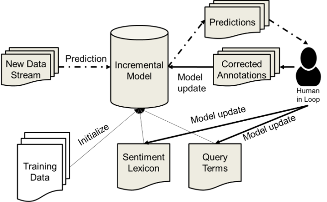

SAIL: Sentiment Analysis and Incremental Learning
===================
SAIL is a tool which gives users the convenience of doing sentiment analysis using pre-trained models. 
The tool also supports incremental learning of the existing models by adding new labeled data.

The model accuracy can be improved by using domain specific lexicons and query terms.  
Our software architecture is as follows:

Contributors:
-------------

* [Shubhanshu Mishra](http://shubhanshu.com) - <smishra8@illinois.edu>
* Liang Tao - <ltao3@illinois.edu>
* Chieh-Li Chin - <cchin6@illinois.edu>

**Advisor:** [Jana Diesner](http://people.ischool.illinois.edu/~jdiesner/) - <jdiesner@illinois.edu>

License:
--------
### SAIL Application Executable Files
The SAIL Application Executable Files (i.e. SAIL.dmg, SAIL-1.x-x64.exe, SAIL-1.x-x86.exe, SAIL.jar, and SAIL.zip) are licensed under **GNU General Public License version 3.0 or later** license.

The executable files include the following:
* The application code, packaged into a set of JAR files, plus any other application resources (data files, native libraries)
* A private copy of the Java and JavaFX Runtimes, to be used by this application only
* A native launcher for the application
* Metadata, such as icons

Copyright (c) 2015 University of Illinois Board of Trustees, All rights reserved. Other copyright statements provided below.

Developed at GSLIS/ the iSchool, by Dr. Jana Diesner, Shubhanshu Mishra, Liang Tao, Chieh-Li Chin.

### U of I Source Codes
The following files are released under **GNU General Public License version 2.0 or later** license:
* All files in directory "build"
* All files in directory "logo"
* All files in directory "nbproject"
* All files in directory "src"
* .classpath, .project, build.fxbuild, build.xml, mainfest.mf, and train_model.sh

Copyright (c) 2015 University of Illinois Board of Trustees, All rights reserved.

Developed at GSLIS/ the iSchool, by Dr. Jana Diesner, Shubhanshu Mishra, Liang Tao, Chieh-Li Chin.

### Dependencies
The following dependencies are required for the application, and should be used under their licenses.

#### GPL License:

* WEKA:                      GNU General Public License v3.0  http://www.cs.waikato.ac.nz/ml/weka/ 
* Ark-Tweet-NLP:             GNU General Public License v2.0 or later  https://github.com/brendano/ark-tweet-nlp/blob/master/LICENSE.txt
* MPQA Subjectivity Lexicon: GNU General Public License v3.0  http://mpqa.cs.pitt.edu/ 
 
#### Apache License:

* Twitter-Text:              Apache 2.0 License  https://github.com/twitter/twitter-text
* Twitter4j:                 Apache 2.0 License  http://twitter4j.org/en/index.html
* OpenCSV:                   Apache 2.0 License  http://opencsv.sourceforge.net/license.html
* Apache Commons Lang3:      Apache 2.0 License  https://commons.apache.org/proper/commons-lang/project-summary.html
* SentimentSocialNets:       Apache 2.0 License  https://github.com/napsternxg/SentimentSocialNets

#### Other Licenses:

* D3.js:                     [3-Clause BSD License](https://github.com/mbostock/d3/blob/master/LICENSE)  http://d3js.org/
* jQuery:                    [MIT License](https://jquery.org/license/)           https://jquery.org/license/

#### Model trained on SEMEVAL 2013 data

For training the word model, which is part of SAIL, we have used the SEMEVAL 2013 Task 2 part B - Twitter sentiment analysis data which contains tweet level sentiment labels for more than 20,000 tweets. We have trained our model on TRAIN+DEV+TEST data. We have only trained the model on the tweets which were labelled as positive or negative in the dataset. The data is released under a Creative Commons Attribution 3.0 Unported License (http://creativecommons.org/licenses/by/3.0/). 

SemEval'2013: SemEval-2013 Task 2: Sentiment Analysis in Twitter.
Preslav Nakov, Sara Rosenthal, Zornitsa Kozareva,
Veselin Stoyanov, Alan Ritter, Theresa Wilson
http://www.aclweb.org/anthology/S/S13/S13-2052.pdf 

Citing SAIL:
-------------
While not a condition of use, the developers would appreciate if you acknowledge its use with a citation:

[Mishra, Shubhanshu, Jana Diesner, Jason Byrne, and Elizabeth Surbeck. "Sentiment Analysis with Incremental Human-in-the-Loop Learning and Lexical Resource Customization." In Proceedings of the 26th ACM Conference on Hypertext & Social Media, pp. 323-325. ACM, 2015.](http://dl.acm.org/citation.cfm?id=2791022) http://dl.acm.org/citation.cfm?id=2791022

Diesner, Jana., Mishra, Shubhanshu., Tao, Liang., Chin, Chieh-Li. (2015). SAIL: Sentiment Analysis and Incremental Learning [Software]. Available from http://people.lis.illinois.edu/~jdiesner/sail.html

